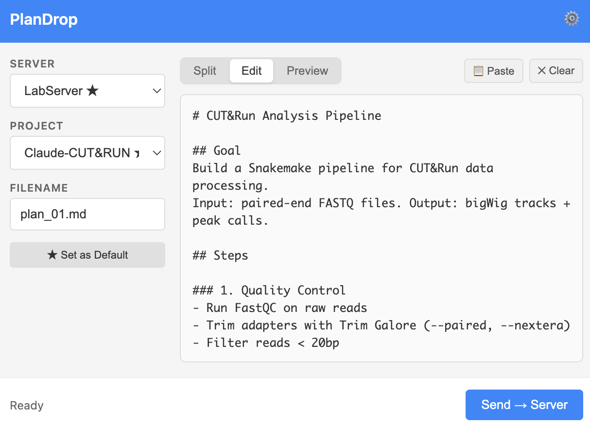

# PlanDrop

**Drop markdown prompts from your browser to projects on remote servers. Your AI coding agent reads and implements.**

A Chrome extension for developers running AI coding agents (Claude Code, Aider, Cursor, etc.) on remote machines. Plan in your browser, send to your server, execute with AI.



## Quick Start

### Prerequisites

- **Google Chrome** (or see [Browser Support](#browser-support) for Edge/Brave/Arc)
- **Python 3**: Required for the native messaging host
- **SSH access**: Key-based SSH access to your remote server(s)

**Platform-specific:**
- **macOS**: Python 3 is pre-installed on macOS 12.3+. If missing: `brew install python3`
- **Linux**: Install via package manager: `apt install python3` or `yum install python3`
- **Windows**: Requires Windows 10 (1809+) or Windows 11 with OpenSSH client enabled (Settings → Apps → Optional Features → OpenSSH Client). Install Python 3 from [python.org](https://www.python.org/downloads/) and ensure it's in PATH.

### Step 1: Clone the repository

```bash
git clone https://github.com/genecell/PlanDrop.git
cd PlanDrop
```

### Step 2: Load the extension in Chrome

1. Go to `chrome://extensions/`
2. Enable **Developer mode** (toggle in top right)
3. Click **Load unpacked** → select the `extension/` folder
4. Note the **Extension ID** shown on the card (you'll need this next)

### Step 3: Install the native messaging host

**macOS / Linux:**
```bash
cd native-host
chmod +x install.sh
./install.sh <your-extension-id>
```

**Windows (PowerShell):**
```powershell
cd native-host
.\install.ps1 <your-extension-id>
```

### Step 4: Configure a server

1. Click the PlanDrop icon in Chrome toolbar
2. Click the ⚙ gear icon to open Settings
3. Add a server:
   - **Name**: `my-gpu-server` (display name)
   - **SSH target**: `labgpu` (SSH config alias) or `user@192.168.1.100`
4. Add a project under that server:
   - **Name**: `ml-training` (display name)
   - **Remote path**: `/home/user/projects/ml-training`
5. Click **Set as Default** (optional) → done!

Using Edge, Brave, or Arc? See [Browser Support](#browser-support).

---

## Why PlanDrop?

### 1. Eliminate file transfer friction

Instead of: SSH → navigate to project → create file → paste → save

Just: Click PlanDrop → select project → send

One click to drop a prompt into any project on any server.

### 2. Prompts as persistent files

Every prompt you send is saved as a `.md` file on the server:
- **Natural backup** - never lose a prompt again
- **Re-readable** - review what you sent days or weeks later
- **Re-sendable** - update and resend without retyping
- **Git-trackable** - commit your prompts alongside your code
- **Debuggable** - when something goes wrong, see exactly what you asked for

Unlike copy-paste into a terminal, which vanishes the moment you close the window.

### 3. Multi-project routing

Running Claude Code on three different projects across two servers? PlanDrop remembers your servers and projects. Pick from a dropdown, click send. No more SSH juggling.

### 4. Reusability

Send the same implementation plan to multiple servers or projects without retyping. Export your server config and import it on another machine.

## How It Works

```
1. Plan in browser     →  Claude.ai, ChatGPT, or any AI chat
2. Send via PlanDrop   →  Copy → click extension → pick target → send
3. Execute on server   →  claude "read plan.md and implement step by step"
```

The file lands in your project directory. Your AI coding agent reads it and gets to work.

## Who Is This For?

Developers running AI coding agents on remote machines:

- **ML engineers** - GPU servers, training clusters
- **Bioinformaticians** - HPC nodes, shared compute
- **DevOps / SREs** - cloud VMs, containers
- **Anyone with a remote dev setup** - lab servers, cloud instances

If you SSH into a machine to run Claude Code, Aider, Cursor, or similar tools, PlanDrop saves you time.

## Architecture

```
Browser                    Local Machine              Remote Server
───────                    ─────────────              ─────────────
Claude.ai / ChatGPT
       ↓ copy
PlanDrop extension  ──→  Native host  ──→  SCP/SSH  ──→  ~/project/plan.md
                         (Python)                              ↓
                                                        AI coding agent
                                                        reads & executes
```

## Features

**Core:**
- Multi-server, multi-project configuration with defaults (★)
- One-click send to any configured project directory
- Custom filenames (default: `plan.md`)
- File collision detection - warns before overwriting
- Settings import/export (JSON) for sharing across machines

**Editor:**
- Built-in markdown editor with live preview
- Split / Edit / Preview toggle modes
- Clipboard auto-fill on popup open
- Draft auto-save - remembers content even when popup closes

**Extras:**
- Right-click context menu: "Send selection to PlanDrop"
- Cross-platform: macOS, Linux, Windows
- Works with Chrome, Edge, Brave, Arc, and other Chromium browsers

**Note:** While PlanDrop is designed for markdown prompts, it can send any text file: Python scripts, shell scripts, R scripts, config files, etc. Just change the filename extension in the popup (e.g., `script.py`, `config.yaml`, `run.sh`).

## SSH Setup

PlanDrop uses your existing SSH keys. Recommended setup:

```bash
# Generate a key if you don't have one
ssh-keygen -t ed25519

# Copy it to your server
ssh-copy-id user@192.168.1.100

# Add an alias to ~/.ssh/config (recommended)
Host labgpu
    HostName 192.168.1.100
    User your-username
    IdentityFile ~/.ssh/id_ed25519
```

Then use `labgpu` as the SSH target in PlanDrop settings. This keeps your server IP out of Chrome storage.

## Example Workflow

### Step 1: Plan in the browser

Use Claude.ai, ChatGPT, or any AI assistant to develop your implementation plan:

```markdown
# Add User Authentication

## Phase 1: Database
- Add users table (email, password_hash, created_at)
- Add sessions table for refresh tokens

## Phase 2: API
- POST /auth/register
- POST /auth/login
- POST /auth/logout

## Phase 3: Middleware
- JWT validation
- Rate limiting
```

### Step 2: Send via PlanDrop

1. Copy the plan (`Ctrl+C`)
2. Click the PlanDrop extension icon
3. Plan auto-fills from clipboard, review/edit if needed
4. Select target: **Lab GPU Server → ml-training**
5. Click **Send → Server**

File saved: `~/projects/ml-training/plan.md`

### Step 3: Execute on server

```bash
$ ssh labgpu
$ cd ~/projects/ml-training
$ claude   # or: aider, cursor, continue, etc.

> read plan.md and implement step by step, testing each phase
```

Your AI coding agent reads the plan and implements autonomously.

## Multi-Profile Setup

If you use multiple Chrome profiles:

**Option A: Chrome Web Store (recommended)**

Publish as Unlisted ($5 one-time fee) → one fixed Extension ID across all profiles → install native host once.

**Option B: Self-distribute**

Each profile gets a different Extension ID. Collect all IDs and pass them to the installer:

```bash
./install.sh <profile1-id> <profile2-id> <profile3-id>
```

To avoid re-configuring servers in each profile, use Import/Export in Settings:

1. Configure everything in one profile
2. Settings → Export Settings → save JSON
3. In other profiles → Settings → Import Settings → load the same JSON

## Updating

```bash
cd ~/PlanDrop
git pull

# Extension: go to chrome://extensions/ and click 🔄 on PlanDrop
# Native host: automatically picks up the updated script
# Only re-run install.sh if instructed by release notes
```

## Browser Support

| Browser | Status |
|---------|--------|
| Chrome | Fully supported |
| Edge | Supported (Chromium-based) |
| Brave | Supported (Chromium-based) |
| Arc | Supported (Chromium-based) |
| Firefox | Not supported (different extension API) |
| Safari | Not supported (requires native Xcode wrapper) |

### Installing on Edge

1. Go to `edge://extensions/`
2. Enable **Developer mode** (toggle in left sidebar)
3. Click **Load unpacked** → select the `extension/` folder
4. Note the **Extension ID**
5. Run: `./install.sh <edge-extension-id>` (or add to existing IDs)

### Installing on Brave

1. Go to `brave://extensions/`
2. Enable **Developer mode** (toggle in top right)
3. Click **Load unpacked** → select the `extension/` folder
4. Note the **Extension ID**
5. Run: `./install.sh <brave-extension-id>` (or add to existing IDs)

### Installing on Arc

Arc uses Chrome's extension system. Follow the Chrome instructions but access extensions via Arc's settings menu.

### Using multiple browsers

Each browser gets its own Extension ID. Pass all IDs to the installer:

```bash
# macOS / Linux
./install.sh <chrome-id> <edge-id> <brave-id>

# Windows
.\install.ps1 <chrome-id> <edge-id> <brave-id>
```

## Security & Privacy

- **Write-only** - PlanDrop can send files to your server but cannot read, list, or download files from it
- **No third-party servers** - all data flows directly from your browser → local native host → your server via SSH
- **No analytics or telemetry** - zero external network requests
- **SSH keys stay with your OS** - the extension never sees or accesses your SSH credentials. The native host uses your existing SSH agent
- **Sandboxed extension** - Chrome's native messaging protocol means the extension cannot access your filesystem or run commands directly. Only the native host (which you install and control) has SSH access
- **Open source** - full source code available for audit

## Troubleshooting

### "Send" button stays disabled

- Must select both a server AND a project
- Add projects in Settings (⚙ icon)

### "Connection failed" on Test Connection

- Verify SSH works manually: `ssh your-alias "echo ok"`
- Check that your SSH key is added: `ssh-add -l`
- On macOS, you may need to add to keychain: `ssh-add --apple-use-keychain ~/.ssh/id_ed25519`

### Extension can't connect to native host

- Re-run the installer: `./install.sh <extension-id>` (macOS/Linux) or `.\install.ps1 <extension-id>` (Windows)
- Verify the Extension ID matches (check your browser's extensions page)
- Check log file: `~/.plandrop/relay.log` (macOS/Linux) or `%USERPROFILE%\.plandrop\relay.log` (Windows)
- Make sure the host script is executable: `chmod +x native-host/plandrop_host.py`

### "Add Project" button not working

- Refresh the extension in your browser's extensions page → click 🔄
- Try closing and reopening the Settings page

### Python not found

- **macOS**: Python 3 is pre-installed on macOS 12.3+. If missing: `brew install python3`
- **Linux**: `sudo apt install python3` or `sudo yum install python3`
- **Windows**: Install from python.org and ensure it's in PATH

### Editor content disappeared

- This should no longer happen. Drafts auto-save. If it does, refresh PlanDrop from your browser's extensions page.
- Use the "📋 Paste" button to re-fill from clipboard.
- Click "Clear" to start fresh.

## Roadmap

- [ ] Chrome Web Store release
- [ ] Keyboard shortcut for quick send
- [ ] Template system for common prompts
- [ ] File history / recent sends

## License

BSD-3-Clause

## Contributing

[github.com/genecell/plandrop](https://github.com/genecell/plandrop)

Issues and PRs welcome.
